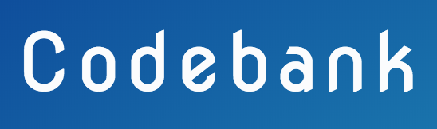
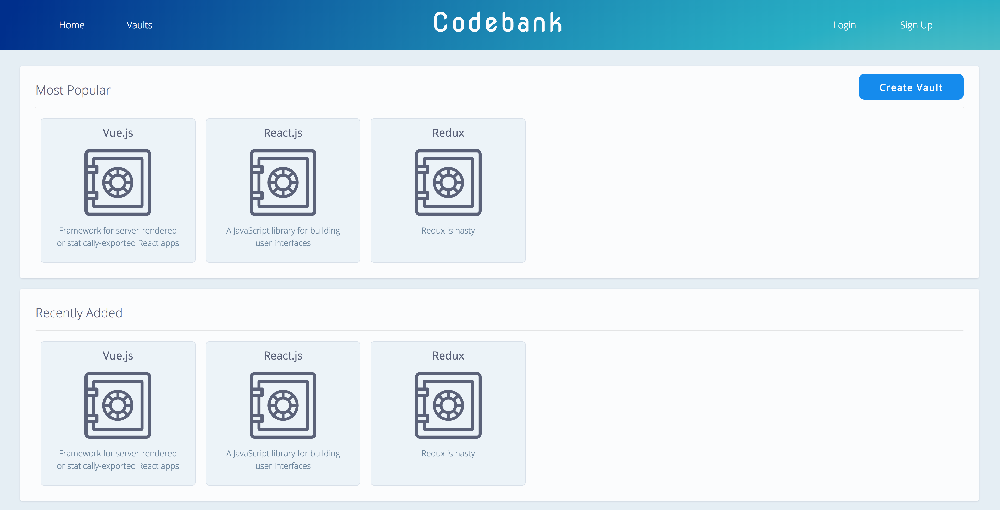
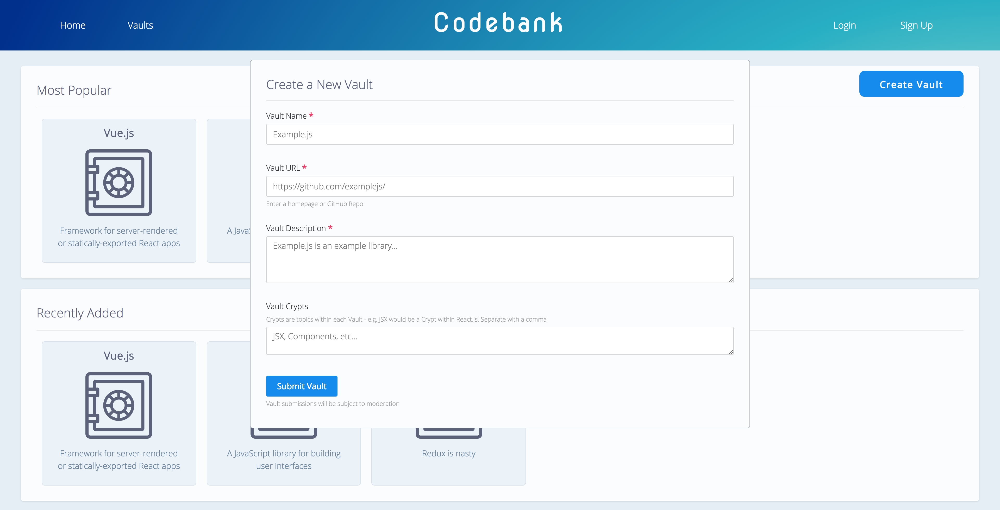
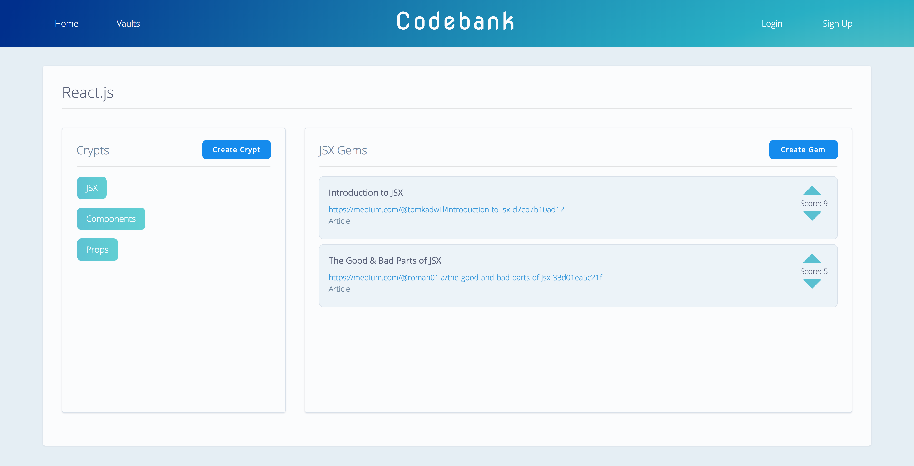
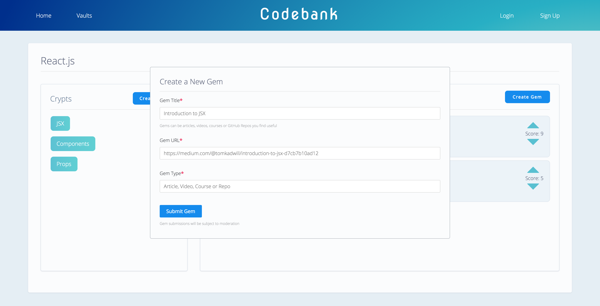

 </img>

# Codebank
The online bank for coding content

## What is Codebank?
Codebank is an open-source project currently in development with the aim of helping software developers code more efficiently. The app allows users to organize and add coding content to 'Vaults' based around major topic - e.g. React, Redux or Angular.

Within each Vault, users will find sub-topics, which are represented as 'Crypts' - e.g. JSX, Components and State - that contain 'Gems' of content. These 'Gems' consist of articles, videos, courses and GitHub Repos that other users can submit if they find them useful or insightful. Each 'Gem' can then be voted up or down by users to demonstrate it's quality or helpfulness. The idea is the help users find and access the best content.

## Tech Stack:
### Front-end:
* React
* Redux

### Back-end: (https://github.com/georgeperry1/Codebank-server)
* Koa
* Mongoose
* MongoDB

## Screenshots:  

  

    </img>
  

  

   </img>
  

  

    </img>
  

  

    </img>
  

  

    </img>
  

